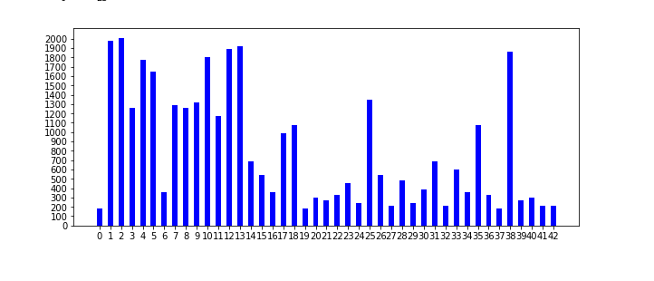
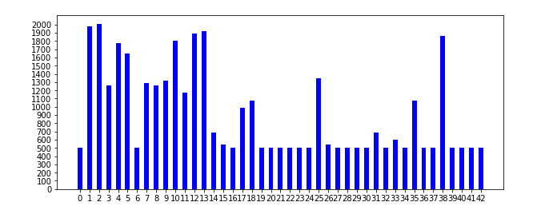
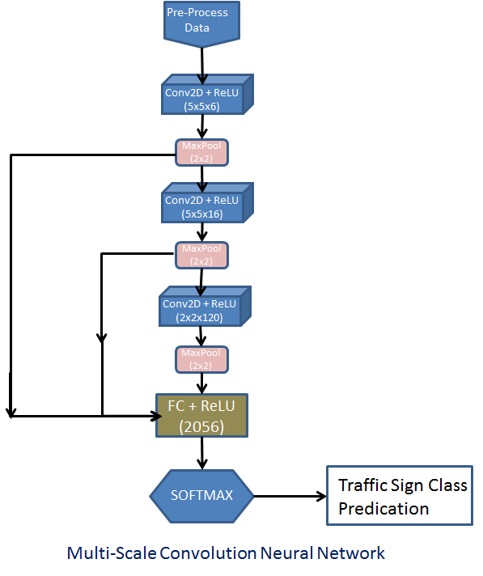
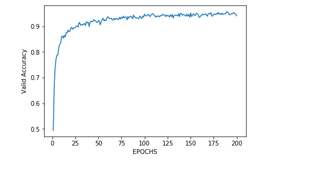
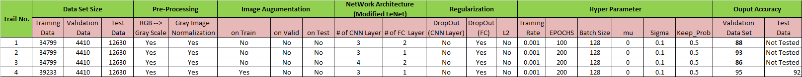
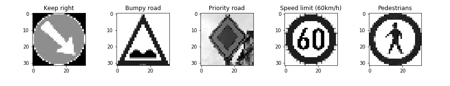
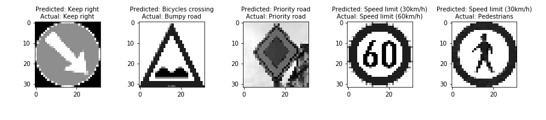

### Self-Driving Car Engineer Nanodegree
## Deep Learning

## Traffic Sign Recognition Classifier Project
### Build a Traffic Sign Recognition Project

The goals / steps of this project are the following:

1. Load the data set (see below for links to the project data set)
2. Explore, summarize and visualize the data set
3. Design, train and test a model architecture
4. Use the model to make predictions on new images
5. Analyze the softmax probabilities of the new images
6. Summarize the results with a written report


### Writeup / README

### Step-1 : Data Set Summary & Exploration :
#### Question1 : Provide a basic summary of the data set and identify where in your code the summary was done. In the code, the analysis should be done using python, numpy and/or pandas methods rather than hardcoding results manually.
#### Ans : 

1. Load the Data : The "traffic-signs-data.zip" contain 3 pickle files : train.p , valid.p, test.p . code to load the dataset is written in cell no 1.

2. Data Set Summary : Code to get data summary is written is cell 2. Below are training, validation and test data set size. This also consist shape of image, unique classes.

    a) The size of training set is :34799
    
    b) The size of test set is : 12630
    
    c) The size of Validation set is : 4410
    
    d) The shape of a traffic sign image is : (32, 32, 3)
    
    e) The number of unique classes/labels in the data set is : 43
    

#### Question 2 : Include an exploratory visualization of the dataset and identify where the code is in your code file.
#### Ans :
cell 3 consist the code to visualize the data set. It does following things.

1) It picks up the randdom image from the training data and show that. This is done to see how training data sets look like.

2) Ploted the the bar graph to see how training datasets are distributed. This confirms that data are not equally distributed. It ranges from approx 200 images to 2000 images. below graph confirms that.





### Step - 2 : Design and Test a Model Architecture

##### Question 1 :Describe how, and identify where in your code, you preprocessed the image data. What tecniques were chosen and why did you choose these techniques? Consider including images showing the output of each preprocessing technique. Pre-processing refers to techniques such as converting to grayscale, normalization, etc.

#### Ans :
cell 4 consist the code to preprocess the training data. I have implemented follwoing two things.
1. Converting image to grayscale. I did it because of color does not take part in classify the sign and hence does not matter whether it is color or grascale. It certaininly it helps to reduce the compute.

2. Normalization: It is recommended to have 0 mean and equal variance because it helps to converge network fatser to reach to global minimum. It make optimizer life eaiser to find good solution.


##### Question 2. Describe how, and identify where in your code, you set up training, validation and testing data. How much data was in each set? Explain what techniques were used to split the data into these sets. (OPTIONAL: As described in the "Stand Out Suggestions" part of the rubric, if you generated additional data for training, describe why you decided to generate additional data, how you generated the data, identify where in your code, and provide example images of the additional data)

#### Ans :
Cell 5 is having code image augmentation. After visualising the training data sets, I saw that huge difference in number of  images for each class, few were having 2000+ images and few were just 200, So thought of having 500 images for each class in training set and that trigger me to do the image augmentation. This help me to increase the validation accuracy by 4%.Without data augmentation, Validation accuracy was 91%. 

Below are different thing for image aumentation.

1. Blurring of image, used opencv python api(cv2.GaussianBlur) for the same.
2. Rotation of iamges by 2 degree,cv2.getRotationMatrix2D
3. Tranlation of images.

Training set after after augmentation: (39239, 32, 32, 1), before this tarining set was having total no of 34799 images.
Below is bar graph which shows the image distribution in each class after aumentations.

I have used same noumber of images for validation and training sets which was given for the projects which was follows.

Validation sets:  4410, Testing sets: 12630.
Ideally this should be in training vs vlidation vs testing [60% 20% 20%]



#### Question 3. Describe, and identify where in your code, what your final model architecture looks like including model type, layers, layer sizes, connectivity, etc.) Consider including a diagram and/or table describing the final model.

#### Ans : 
Ipython notebook cell 6 covers code for network architecture. Started modeling my neowrk based on lenet, which gave me accuracy approx 87%. I found good paper on Multi-Scale Convolutional Networks. I had change my netwrok archtecture as per this paper which has given me the accuracy upto 95%. 
Link of [Multi-Scale Convolutional Networks](http://yann.lecun.com/exdb/publis/pdf/sermanet-ijcnn-11.pdf)

 It is fairly simple and has 4 layers: 3 convolutional layers for feature extraction and one fully connected layer as a classifier. As opposed to usual strict feed-forward CNNs I use multi-scale features, which means that convolutional layers’ output is not only forwarded into subsequent layer, but is also branched off and fed into classifier (e.g. fully connected layer).Below is archtecture image of my network.




#### why CNN?
This is best suited if you are havining image as input data. Humans classify images not by seeing the complete object but a portion of object and detect the complete object.CNNs use similar approach.This help us for feature extarction of portion of image and then taking output from each convolution to recognise complete object.

#### RelU?
ReU is simplest non linear funtion. I had used RelU for activation to make my function non-linear. linear function is provide us to use limted no of parameteres[(n+1)k where n no of input, k is output] but non-linear function enable us to use as many parameters as required.

#### Softmax?
Conceptually, the benefit of the max pooling operation is to reduce the size of the input, and allow the neural network to focus on only the most important elements.
Max pooling does this by only retaining the maximum value for each filtered area, and removing the remaining value. This reduces the risk of overfitting. 

#### Dropout?
I had used dropout as Regularization techinique. Regulaization is to apply the artifical constraint to reduce parameteres. This helps to reduce the risk of overfittings and improve the accuracy. dropout value used is .5. This looks scary where droping almost half of the activation unit but increases the accuracy.


#### Question 4. Describe how, and identify where in your code, you trained your model. The discussion can include the type of optimizer, the batch size, number of epochs and any hyperparameters such as learning rate.

#### Ans :
Ipython notebook cell 7 covers code for training the models. Refer cell 8 for EPOCH VS valaccuracy graph.
Batch_Size : I had used batch sie of 128. Batch size of 128 is optimized for CUDA and hence if we are using Nvidia GPU this would help us reduce training time.

I had used EPOSH = 200, I had used 200 because i notitced that my accuracy was increasing with EPOSH but it was almost constant after reaching 200.



I had used learing rate of .001. 

#### Question 5. Describe the approach taken for finding a solution. Include in the discussion the results on the training, validation and test sets and where in the code these were calculated. Your approach may have been an iterative process, in which case, outline the steps you took to get to the final solution and why you chose those steps. Perhaps your solution involved an already well known implementation or architecture. In this case, discuss why you think the architecture is suitable for the current problem.

#### Ans :

Ipython notebook cell 7 covers code for calculating validation accuracy and cell 9 to calcuate the test accuracy. Before finalizing the final model, I have experimented with changing different parameters used in my network. below are list of them.



My final model results are:

a. Validation set accuracy of : ***94. 1%***


b. Test set accuracy of : ***92%***


### Step - 3 : Test a Model on New Images
#### Question 1. Choose five German traffic signs found on the web and provide them in the report. For each image, discuss what quality or qualities might be difficult to classify.
#### Ans :Here are five German traffic signs that I found on the web:
Ipython notebook cell 10 used to pre-process the downloaded the german sign images. I thing speed limit sign image is difficult one to predict because it has different number every time.

I see my network very senstive to blurred image and noisy images. For speed limit one, may be the number would be difficult to classify network may get it wrong . For bumpy road sign image, bump looks blurred and contrast is very high. Priority image is blurry and hence may be difficult to classify. 



#### Question 2. Discuss the model's predictions on these new traffic signs and compare the results to predicting on the test set. Identify where in your code predictions were made. At a minimum, discuss what the predictions were, the accuracy on these new predictions, and compare the accuracy to the accuracy on the test set (OPTIONAL: Discuss the results in more detail as described in the "Stand Out Suggestions" part of the rubric).
#### Ans :

Ipython notebook cell 13 code used for prediction of test sets. I am getting accuracy of 40%. Below are top 5 probability output.

Image 1:(Keep right)
Top 5 probabilites: [ 1.  0.  0.  0.  0.]
Top 5 indexes: [38  0  1  2  3]

Image 2:(Bumpy road)
Top 5 probabilites: [  1.00000000e+00   2.03861853e-23   2.16752687e-29   2.08920319e-36
   6.71768078e-38]
Top 5 indexes: [29 25 24 34 30]

Image 3:(Priority road)
Top 5 probabilites: [  1.00000000e+00   2.73889671e-26   5.66895034e-31   9.07308804e-34
   0.00000000e+00]
Top 5 indexes: [12 40 13 38  0]

Image 4:(Speed limit (60km/h))
Top 5 probabilites: [  1.00000000e+00   7.68474528e-09   4.94167651e-10   1.83105769e-13
   1.96619026e-15]
Top 5 indexes: [ 1  2  7  5 11]

Image 5:(Pedestrians)
Top 5 probabilites: [  9.99789774e-01   2.09521429e-04   4.95377947e-07   2.85196336e-07
   3.95742224e-11]
Top 5 indexes: [ 1  5 25 18 11]

#### Image 1:
This was correctly predicted.

#### Image 2: 
Bumpy road. Look like contarst of image is more and hence fails to detect. reducing the contarst while preprocessing should help here. While pre-processing all the image should have similar brightness and contarst.

#### Image 3: 
This was correctly predicted.

#### Image 4:
For image 4, if you see network top predicted level, first two are speed limit tarfic sign i.e 30 KM speed limt and 50 KM speed limit but it fails to predict 60 KM speed limt. Look like backgrond brightnes of number 60 in input image is more and hence it fails to predict.

#### Image 5: 
For image 5, if we see top two prediction, is having circle arround the sign, so network was close to get circle from image but fails to recognise the pedestrian portion of image. reducing brigtness of image should help here.

Here are the results of the prediction:




```python

```
